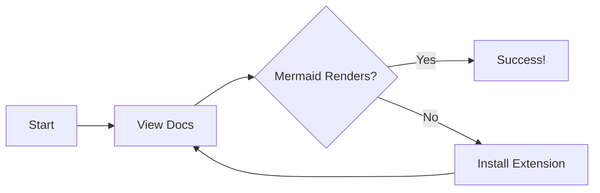

# Viewing Visual Diagrams in Documentation

This document provides information about the visual diagrams in the HRMS documentation and how to view them.

## What Requires External Tools?

The documentation contains **16 Mermaid diagrams** that require special rendering. These diagrams include:

### System Architecture Diagrams (13 diagrams)
- 3-tier system architecture
- Component architecture  
- Module breakdown diagrams
- Deployment architecture (cloud and on-premise scenarios)
- Security architecture layers
- Data flow sequences (login, leave request, payroll processing)
- Integration architecture
- Caching strategy
- Scalability architecture

### Database ER Diagrams (3 diagrams)
- High-level ERD with all entities and relationships
- Module-specific ERD views (Employee Info, Recruitment, Attendance, Payroll, Performance, Training)

## How to View Mermaid Diagrams

### Option 1: VS Code (Recommended)

**VS Code** natively supports Mermaid diagrams with the **Mermaid Preview** extension:

1. Install VS Code from [code.visualstudio.com](https://code.visualstudio.com)
2. Install the extension: **"Mermaid Preview"** by `bierner` or **"Markdown Preview Mermaid Support"** by `bierner`
3. Open any `.md` file with diagrams
4. Press `Ctrl+Shift+V` (or `Cmd+Shift+V` on Mac) to preview
5. Click "Open Preview to the Side" to see rendered diagrams

**Alternative VS Code Extensions:**
- **Markdown Preview Enhanced** by Yiyi Wang
- **Mermaid Editor** by Tomoyuki Aota

### Option 2: Online Mermaid Editor

**Mermaid Live Editor** - Free web-based tool:

1. Visit [mermaid.live](https://mermaid.live)
2. Copy the Mermaid code from any diagram block (between ` ```mermaid ` and ` ``` `)
3. Paste into the editor
4. View the rendered diagram
5. Export as PNG, SVG, or shareable link

**Other Online Options:**
- **Mermaid.ink** - Renders Mermaid to images
- **GitHub** - Automatically renders Mermaid in markdown files (if your repo is on GitHub)

### Option 3: GitHub/GitLab

Both **GitHub** and **GitLab** automatically render Mermaid diagrams in markdown files:

1. Push your documentation to GitHub/GitLab
2. View the `.md` files in the repository
3. Diagrams render automatically in the web interface

**GitHub Example:**
```
https://github.com/username/repo-name/blob/main/docs/architecture/system-architecture.md
```

### Option 4: Dedicated Markdown Viewers

**Desktop Applications:**

- **Obsidian** ([obsidian.md](https://obsidian.md))
  - Free markdown editor with native Mermaid support
  - Open your `docs` folder as a vault
  - Diagrams render automatically

- **Typora** ([typora.io](https://typora.io))
  - WYSIWYG markdown editor
  - Paid software with free trial
  - Built-in Mermaid rendering

- **Notion** ([notion.so](https://notion.so))
  - Import markdown files
  - Supports Mermaid code blocks
  - Good for team collaboration

**Browser Extensions:**

- **Markdown Viewer** for Chrome/Firefox
  - Some support Mermaid rendering
  - Check extension capabilities first

### Option 5: Convert to Static Images

For presentations or documents without Mermaid support:

1. Use [Mermaid Live Editor](https://mermaid.live)
2. Export diagrams as PNG or SVG
3. Insert into documents

**Command Line Conversion:**
```bash
# Install mermaid-cli
npm install -g @mermaid-js/mermaid-cli

# Convert to PNG
mmdc -i docs/architecture/system-architecture.md -o architecture.png

# Convert to SVG
mmdc -i docs/database/er-diagram.md -o er-diagram.svg
```

### Option 6: Specialized Diagram Tools

If you need to edit or customize the diagrams:

**Free Tools:**
- **Draw.io** ([diagrams.net](https://diagrams.net)) - Web-based, exports Mermaid
- **Creately** ([creately.com](https://creately.com)) - Online diagramming
- **Lucidchart** ([lucidchart.com](https://lucidchart.com)) - Free tier available

**Paid Professional Tools:**
- **Enterprise Architect** - UML/ER diagrams
- **Visual Paradigm** - Enterprise diagramming
- **Lucidchart Pro** - Advanced collaboration

## Diagram Locations

### System Architecture Diagrams
📁 `docs/architecture/system-architecture.md` - **13 diagrams**

Sections containing diagrams:
1. High-Level System Architecture (3-tier)
2. Component Architecture
3. Module Architecture
4. Deployment Architecture - Cloud
5. Deployment Architecture - On-Premise
6. Security Architecture
7. Better Auth Integration
8. Login Flow (sequence)
9. Leave Request Flow (sequence)
10. Payroll Processing Flow (sequence)
11. Integration Architecture
12. Caching Strategy
13. Scalability Architecture

### Database ER Diagrams
📁 `docs/database/er-diagram.md` - **3 diagrams**

Sections containing diagrams:
1. High-Level ERD (all modules)
2. Employee Information Management ERD
3. Recruitment & Onboarding ERD
4. Attendance & Leave Management ERD
5. Payroll Management ERD
6. Performance Management ERD
7. Training & Development ERD

**Note:** Only the first section has the full ERD; other sections reference the same diagram.

## Quick Start - Recommended Setup

For best experience, use this setup:

1. **Install VS Code**
2. **Install "Markdown Preview Enhanced" extension**
3. **Open** `docs/README.md`
4. **Press** `Ctrl+Shift+V` to preview
5. **Navigate** through documentation using embedded links
6. **All diagrams render** automatically

## Testing Your Setup

To verify your setup works, try viewing this simple Mermaid diagram:



If you see a diagram with boxes and arrows, your setup is working!

## Still Having Issues?

If diagrams still don't render:

1. **Check file encoding**: Ensure files are UTF-8
2. **Update extensions**: Check for latest version
3. **Try online editor**: Use [mermaid.live](https://mermaid.live) as fallback
4. **Browser compatibility**: Some browsers handle Mermaid better than others

## Additional Resources

- [Mermaid Documentation](https://mermaid.js.org)
- [Mermaid Gallery](https://mermaid.js.org/syntax/examples.html)
- [VS Code Markdown Guide](https://code.visualstudio.com/docs/languages/markdown)

---

**Last Updated:** January 2025  
**Mermaid Version:** Latest

