# Datafin HRMS - System Architecture

## 1. High-Level System Architecture

### Overview
The Datafin Human Resource Management System (HRMS) is built on a 3-tier architecture that separates concerns across Presentation, Application, and Data layers. The system is designed for hybrid deployment (cloud or on-premise) with robust security and integration capabilities.

### Architectural Tiers

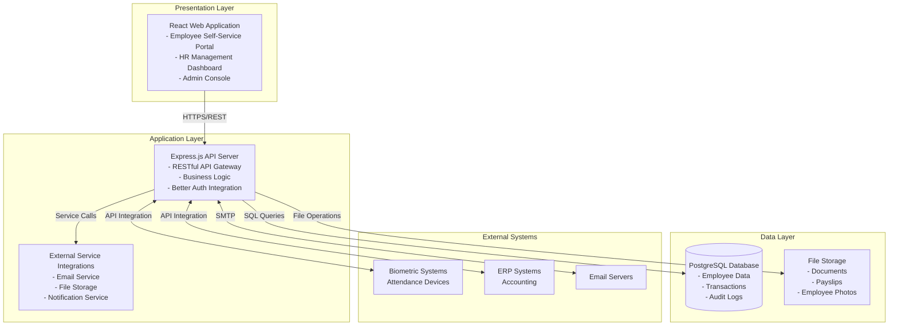

## 2. Component Architecture

### Core Components

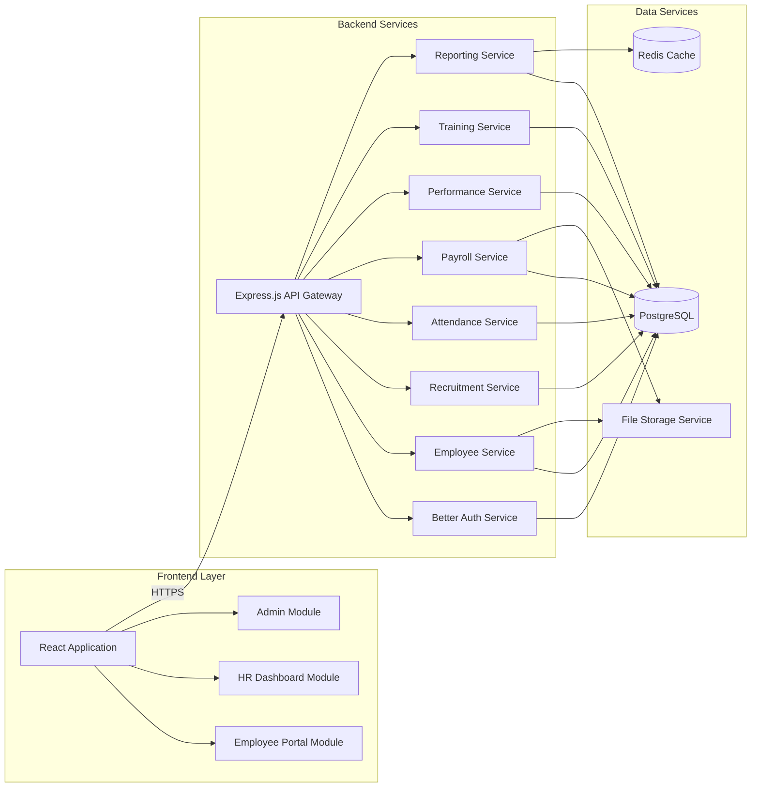

## 3. Module Architecture

### Module Breakdown

```mermaid
graph TD
    subgraph "Employee Information Management"
        EM1[Employee CRUD]
        EM2[Document Management]
        EM3[Department & Position Management]
        EM4[Dependent Management]
    end
    
    subgraph "Recruitment & Onboarding"
        RC1[Job Posting Management]
        RC2[Applicant Tracking System]
        RC3[Interview Scheduling]
        RC4[Offer Letter Generation]
        RC5[Onboarding Workflow]
    end
    
    subgraph "Attendance & Leave Management"
        AL1[Attendance Records]
        AL2[Leave Request Processing]
        AL3[Leave Approval Workflow]
        AL4[Leave Balance Management]
        AL5[Biometric Integration]
    end
    
    subgraph "Payroll Management"
        PY1[Salary Computation Engine]
        PY2[Statutory Deductions]
        PY3[Payslip Generation]
        PY4[Payroll Export]
    end
    
    subgraph "Performance Management"
        PM1[Goal Setting]
        PM2[Appraisal Workflow]
        PM3[360° Feedback]
        PM4[Performance Reports]
    end
    
    subgraph "Training & Development"
        TD1[Course Management]
        TD2[Training Assignment]
        TD3[Completion Tracking]
        TD4[Skill Matrix]
    end
    
    subgraph "Employee Self-Service"
        SS1[Profile Management]
        SS2[Leave Requests]
        SS3[Payslip Access]
        SS4[Appraisal Input]
    end
    
    subgraph "Reports & Dashboards"
        RP1[HR Dashboards]
        RP2[Analytics Engine]
        RP3[Custom Reports]
        RP4[Data Export]
    end
    
    RC5 --> EM1
    AL2 --> AL3
    AL1 --> AL4
    PY1 --> PY2
    PY1 --> PY3
    PM2 --> PM3
    TD2 --> TD3
    SS2 --> AL2
    SS3 --> PY3
```

## 4. Deployment Architecture (Hybrid Model)

### Cloud Deployment Scenario

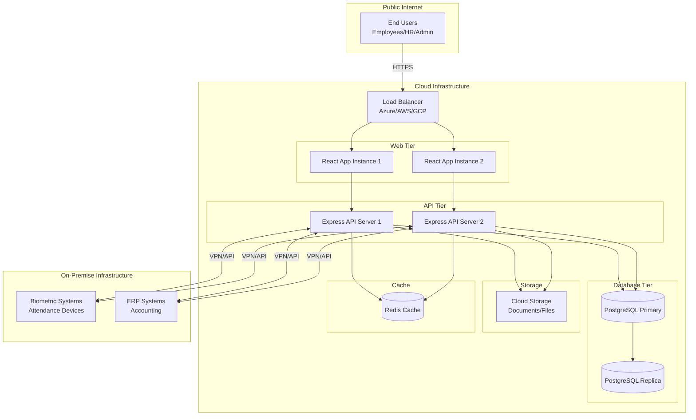

### On-Premise Deployment Scenario

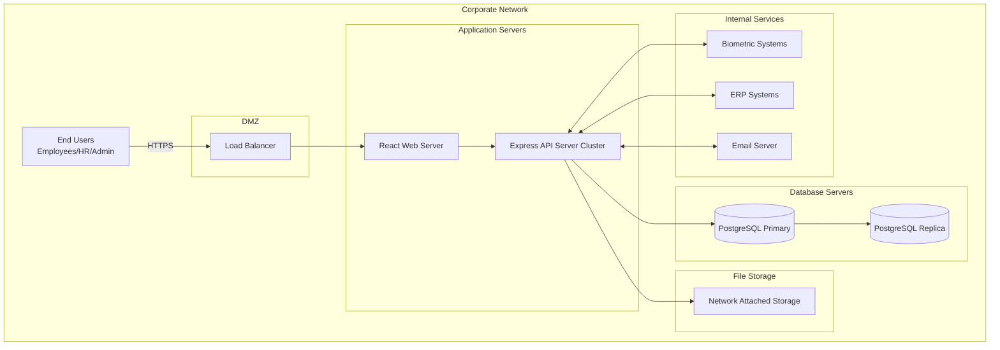

## 5. Security Architecture

### Security Layers

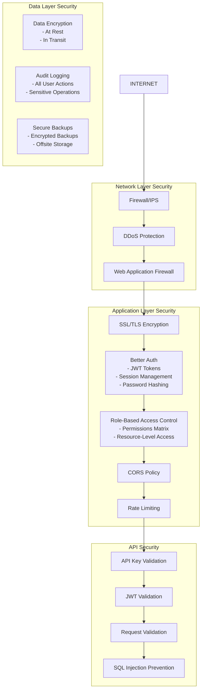

### Better Auth Integration

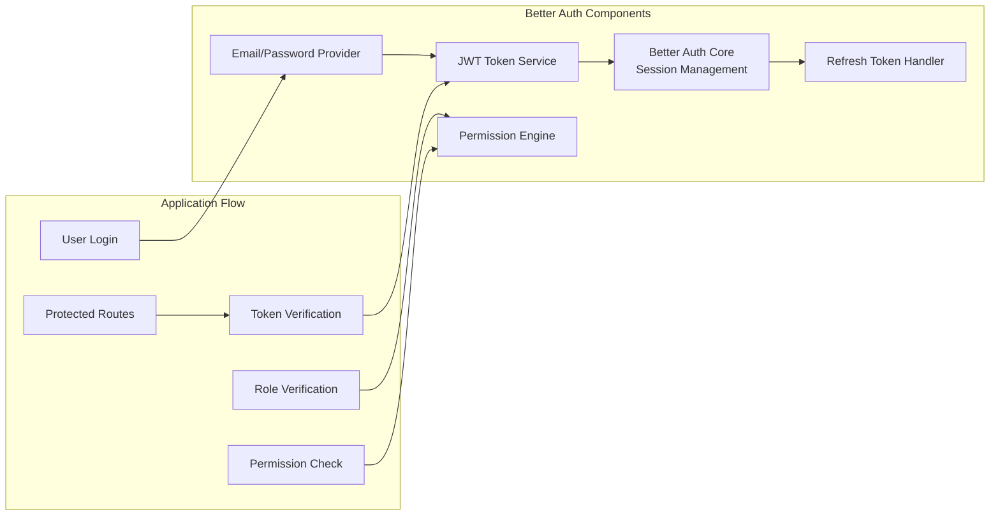

## 6. Data Flow Diagrams

### Login Flow

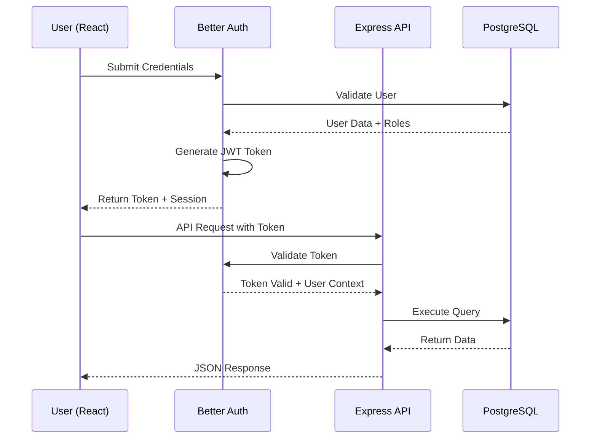

### Leave Request Flow

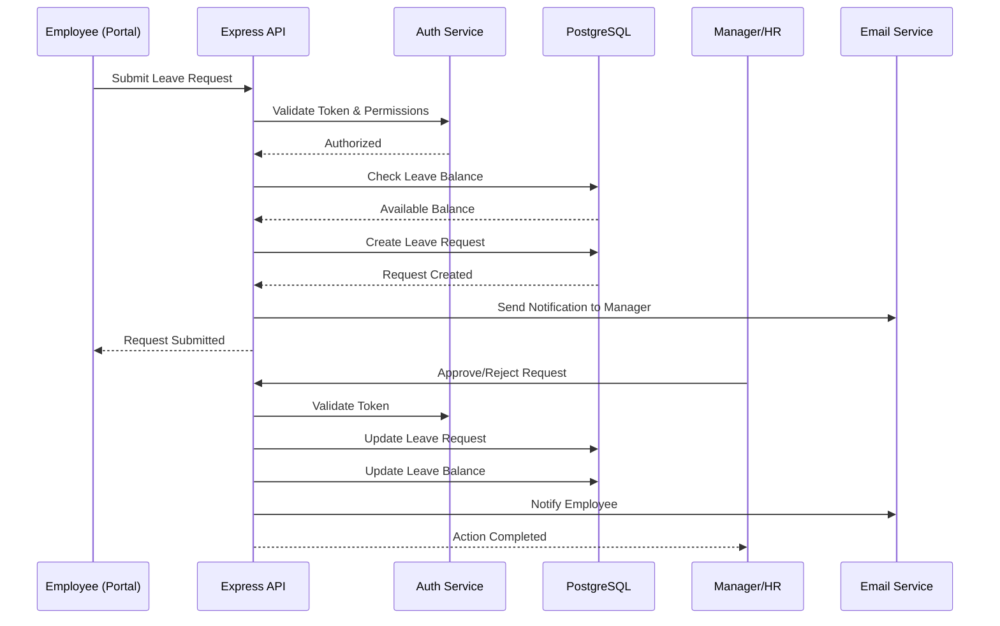

### Payroll Processing Flow

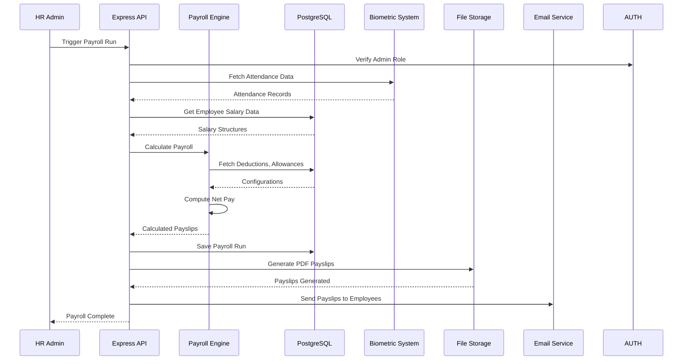

## 7. Integration Architecture

### External System Integrations

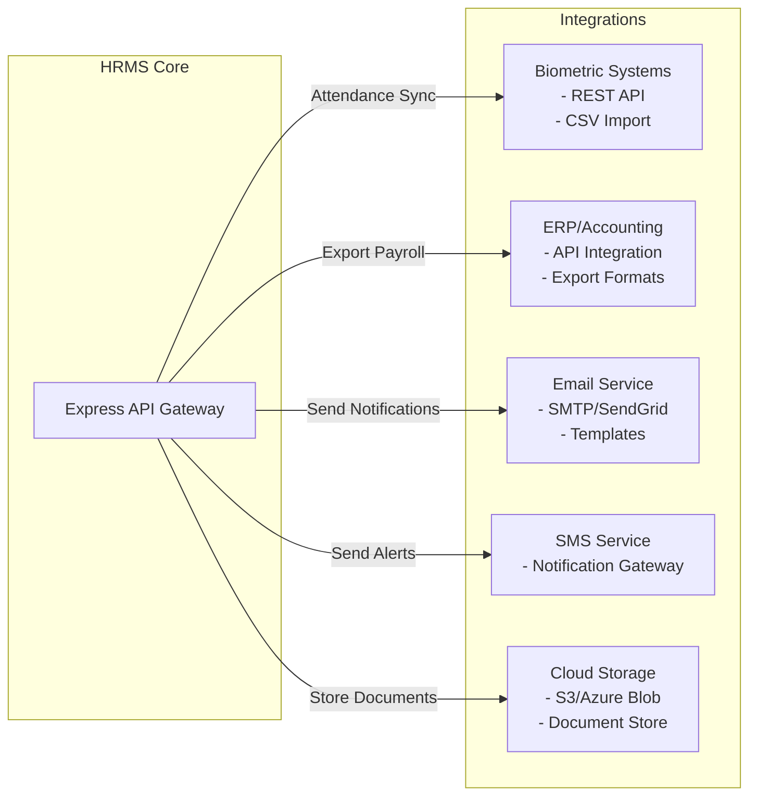

### API Integration Patterns

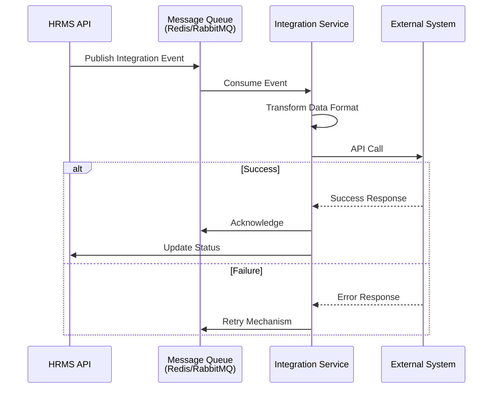

## 8. Caching Strategy

### Cache Architecture

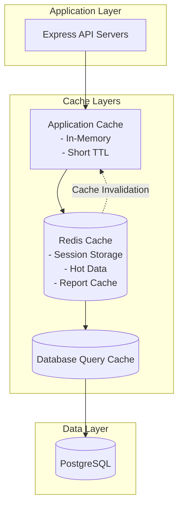

## 9. Scalability Architecture

### Horizontal Scaling Strategy

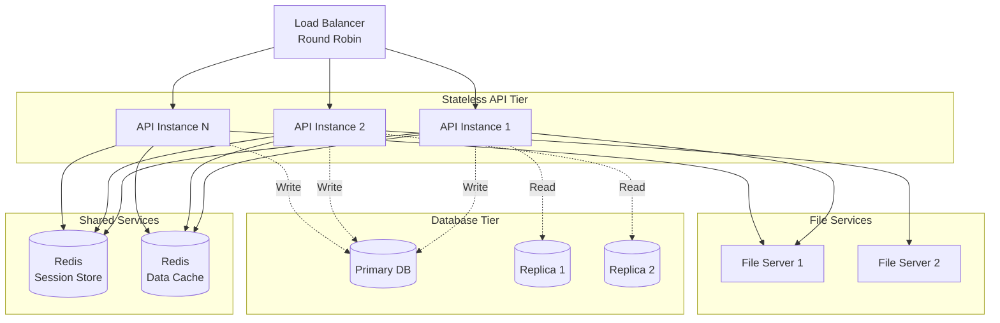

## 10. Technology Stack Summary

### Frontend Stack
- **Framework**: React 18+
- **State Management**: Zustand
- **Routing**: React Router v6
- **Language**: TypeScript
- **HTTP Client**: Axios
- **UI Components**: Shadcn UI or Material-UI
- **Forms**: React Hook Form
- **Charts**: ApexCharts

### Backend Stack
- **Runtime**: Node.js 20+
- **Framework**: Express.js
- **Language**: Javascript
- **Authentication**: Better Auth
- **Validation**: Zod
- **ORM**: Prisma
- **Testing**: Jest

### Database Stack
- **Primary DB**: PostgreSQL 15+
- **Cache**: Redis 7+
- **Full-text Search**: PostgreSQL Full-Text Search
- **Backup**: pg_dump + Cloud Storage

### DevOps Stack
- **Containerization**: Docker
- **Orchestration**: Docker Compose / Kubernetes
- **CI/CD**: GitHub Actions / Jenkins
- **Monitoring**: Prometheus + Grafana
- **Logging**: Winston + ELK Stack
- **APM**: New Relic / Datadog

## 11. Deployment Models

### Model Selection Criteria

| Deployment Model   | Use Case                        | Pros                           | Cons                            |
| ------------------ | ------------------------------- | ------------------------------ | ------------------------------- |
| **Cloud (Public)** | High scalability, global access | Auto-scaling, managed services | Ongoing costs, data sovereignty |
| **On-Premise**     | Data security, compliance       | Full control, no ongoing fees  | High initial cost, maintenance  |
| **Hybrid**         | Best of both worlds             | Flexibility, gradual migration | Complexity, network latency     |

### Recommended Approach

For Datafin HRMS, a **Cloud Deployment Model** is implemented:
- **Frontend**: Vercel (hosting React web application with global CDN)
- **Backend**: Render (hosting Express.js API servers)
- **Database**: Render PostgreSQL (cloud-hosted with automatic backups)
- **Cache**: Redis (managed by Render or cloud provider)

This model provides:
- Accessibility for employees from anywhere
- Automatic scaling and high availability
- Security with HTTPS/SSL encryption
- Cost-effective managed services
- Global CDN for fast frontend delivery
- Easy deployment and maintenance

