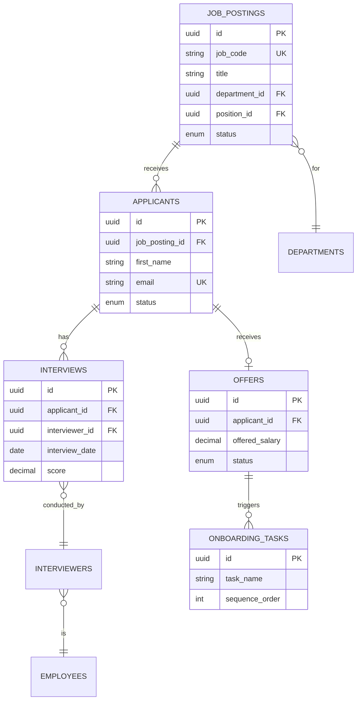
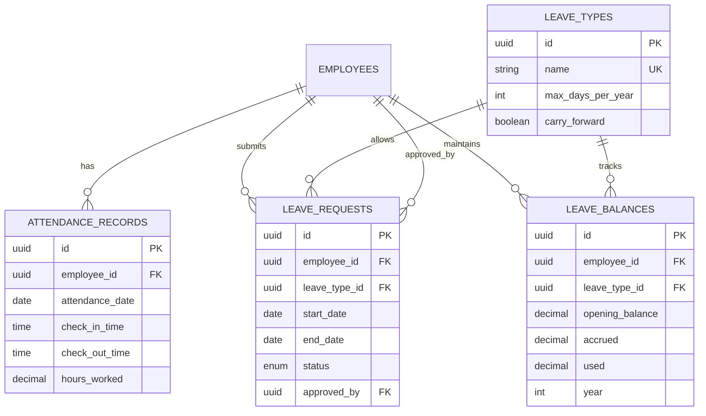
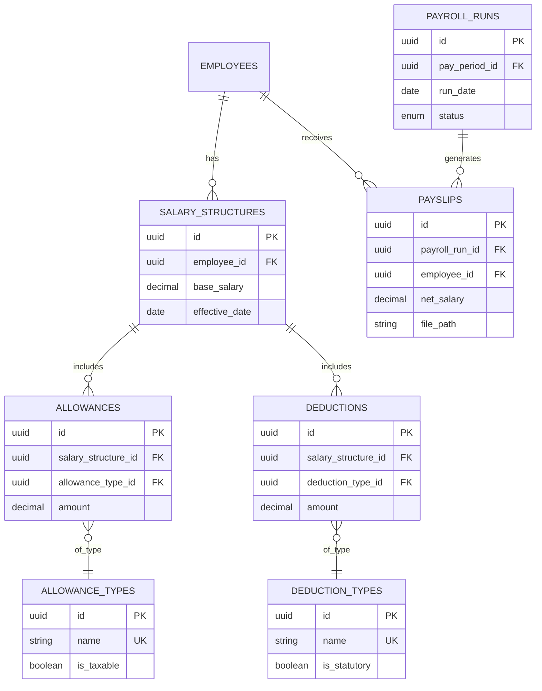
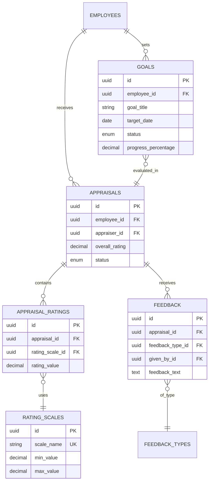
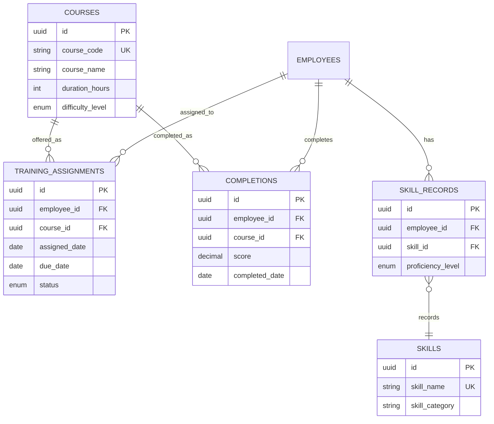

# Datafin HRMS - Entity Relationship Diagram

## Overview
This document provides the Entity Relationship Diagram (ERD) for the Datafin HRMS, covering all 8 core modules with their entities, relationships, and cardinalities.

## High-Level ERD

```mermaid
erDiagram
    %% Core User and Authentication
    USERS ||--o{ USER_ROLES : has
    USERS ||--o{ EMPLOYEES : maps_to
    ROLES ||--o{ USER_ROLES : assigned_to
    ROLES ||--o{ ROLE_PERMISSIONS : has
    PERMISSIONS ||--o{ ROLE_PERMISSIONS : granted_to
    
    %% Employee Module
    EMPLOYEES ||--o{ EMPLOYEE_DOCUMENTS : has
    EMPLOYEES ||--o{ DEPENDENTS : has
    EMPLOYEES }o--|| DEPARTMENTS : belongs_to
    EMPLOYEES }o--|| POSITIONS : holds
    DEPARTMENTS ||--o{ POSITIONS : contains
    DEPARTMENTS }o--|| EMPLOYEES : managed_by
    EMPLOYEES }o--o{ EMPLOYEES : reports_to
    
    %% Recruitment Module
    JOB_POSTINGS ||--o{ APPLICANTS : receives
    JOB_POSTINGS }o--|| DEPARTMENTS : for
    JOB_POSTINGS }o--|| POSITIONS : for
    APPLICANTS ||--o{ INTERVIEWS : has
    APPLICANTS ||--o| OFFERS : receives
    APPLICANTS ||--o{ APPLICANT_DOCUMENTS : has
    INTERVIEWS }o--|| INTERVIEWERS : conducted_by
    INTERVIEWERS }o--|| EMPLOYEES : is
    OFFERS ||--o{ ONBOARDING_TASKS : triggers
    ONBOARDING_TASKS ||--o{ ONBOARDING_COMPLETIONS : tracked_by
    
    %% Attendance and Leave Module
    EMPLOYEES ||--o{ ATTENDANCE_RECORDS : has
    EMPLOYEES ||--o{ LEAVE_REQUESTS : submits
    EMPLOYEES ||--o{ LEAVE_BALANCES : maintains
    LEAVE_TYPES ||--o{ LEAVE_REQUESTS : allows
    LEAVE_TYPES ||--o{ LEAVE_BALANCES : tracks
    LEAVE_REQUESTS }o--|| EMPLOYEES : approved_by
    LEAVE_BALANCES }o--|| LEAVE_TYPES : of_type
    LEAVE_BALANCES }o--|| EMPLOYEES : for_employee
    
    %% Payroll Module
    EMPLOYEES ||--o{ SALARY_STRUCTURES : has
    EMPLOYEES ||--o{ PAYROLL_RUNS : includes
    SALARY_STRUCTURES ||--o{ ALLOWANCES : includes
    SALARY_STRUCTURES ||--o{ DEDUCTIONS : includes
    PAYROLL_RUNS ||--o{ PAYSLIPS : generates
    PAYROLL_RUNS }o--|| PAY_PERIODS : for
    PAYSLIPS }o--|| EMPLOYEES : for
    ALLOWANCES }o--|| ALLOWANCE_TYPES : of_type
    DEDUCTIONS }o--|| DEDUCTION_TYPES : of_type
    
    %% Performance Module
    EMPLOYEES ||--o{ GOALS : sets
    EMPLOYEES ||--o{ APPRAISALS : receives
    EMPLOYEES ||--o{ FEEDBACK_GIVEN : gives
    GOALS }o--|| APPRAISALS : evaluated_in
    APPRAISALS ||--o{ APPRAISAL_RATINGS : contains
    APPRAISALS ||--o{ FEEDBACK : receives
    FEEDBACK }o--|| FEEDBACK_TYPES : of_type
    APPRAISAL_RATINGS }o--|| RATING_SCALES : uses
    
    %% Training Module
    EMPLOYEES ||--o{ TRAINING_ASSIGNMENTS : assigned_to
    COURSES ||--o{ TRAINING_ASSIGNMENTS : offered_as
    EMPLOYEES ||--o{ COMPLETIONS : completes
    COURSES ||--o{ COMPLETIONS : completed_as
    EMPLOYEES ||--o{ SKILL_RECORDS : has
    SKILL_RECORDS }o--|| SKILLS : records
    SKILL_RECORDS }o--|| COMPLETIONS : earned_from
    
    %% Reporting and Audit
    USERS ||--o{ AUDIT_LOGS : generates
    
    %% Entity Definitions
    USERS {
        uuid id PK
        string email UK
        string password_hash
        timestamp created_at
        timestamp updated_at
    }
    
    ROLES {
        uuid id PK
        string name UK
        string description
        timestamp created_at
    }
    
    PERMISSIONS {
        uuid id PK
        string resource
        string action
        string description
        timestamp created_at
    }
    
    EMPLOYEES {
        uuid id PK
        uuid user_id FK
        string employee_code UK
        string first_name
        string last_name
        string email UK
        string phone
        date date_of_birth
        enum gender
        string address
        string city
        string state
        string country
        string postal_code
        uuid department_id FK
        uuid position_id FK
        uuid manager_id FK
        date hire_date
        enum employment_status
        enum employee_type
        string emergency_contact_name
        string emergency_contact_phone
        timestamp created_at
        timestamp updated_at
    }
    
    DEPARTMENTS {
        uuid id PK
        string name UK
        string description
        uuid manager_id FK
        timestamp created_at
        timestamp updated_at
    }
    
    POSITIONS {
        uuid id PK
        string title UK
        string description
        uuid department_id FK
        timestamp created_at
    }
    
    EMPLOYEE_DOCUMENTS {
        uuid id PK
        uuid employee_id FK
        string document_type
        string file_name
        string file_path
        string file_size
        string mime_type
        timestamp uploaded_at
    }
    
    DEPENDENTS {
        uuid id PK
        uuid employee_id FK
        string first_name
        string last_name
        enum relationship
        date date_of_birth
        string phone
        timestamp created_at
    }
    
    JOB_POSTINGS {
        uuid id PK
        string job_code UK
        string title
        text description
        uuid department_id FK
        uuid position_id FK
        enum employment_type
        string experience_required
        string qualifications
        date posting_date
        date closing_date
        enum status
        timestamp created_at
        timestamp updated_at
    }
    
    APPLICANTS {
        uuid id PK
        uuid job_posting_id FK
        string first_name
        string last_name
        string email UK
        string phone
        string resume_path
        enum status
        decimal total_score
        text notes
        timestamp applied_date
        timestamp created_at
        timestamp updated_at
    }
    
    INTERVIEWS {
        uuid id PK
        uuid applicant_id FK
        uuid interviewer_id FK
        string interview_type
        date interview_date
        time interview_time
        string location
        decimal score
        text feedback
        enum status
        timestamp created_at
        timestamp updated_at
    }
    
    OFFERS {
        uuid id PK
        uuid applicant_id FK
        uuid employee_id FK
        decimal offered_salary
        date offer_date
        date acceptance_deadline
        enum status
        text offer_letter_path
        timestamp created_at
        timestamp updated_at
    }
    
    ONBOARDING_TASKS {
        uuid id PK
        string task_name
        text description
        int sequence_order
        uuid assigned_to FK
        enum task_type
        boolean is_required
        timestamp created_at
    }
    
    ONBOARDING_COMPLETIONS {
        uuid id PK
        uuid onboarding_task_id FK
        uuid employee_id FK
        timestamp completed_at
        text notes
    }
    
    ATTENDANCE_RECORDS {
        uuid id PK
        uuid employee_id FK
        date attendance_date
        time check_in_time
        time check_out_time
        decimal hours_worked
        enum attendance_status
        text notes
        timestamp created_at
    }
    
    LEAVE_TYPES {
        uuid id PK
        string name UK
        string code UK
        int max_days_per_year
        boolean carry_forward
        int max_carry_forward
        boolean requires_approval
        timestamp created_at
    }
    
    LEAVE_REQUESTS {
        uuid id PK
        uuid employee_id FK
        uuid leave_type_id FK
        date start_date
        date end_date
        decimal days_requested
        text reason
        enum status
        uuid approved_by FK
        timestamp approved_at
        text approval_notes
        timestamp created_at
        timestamp updated_at
    }
    
    LEAVE_BALANCES {
        uuid id PK
        uuid employee_id FK
        uuid leave_type_id FK
        decimal opening_balance
        decimal accrued
        decimal used
        decimal closing_balance
        int year
        timestamp updated_at
    }
    
    SALARY_STRUCTURES {
        uuid id PK
        uuid employee_id FK
        decimal base_salary
        decimal gross_salary
        date effective_date
        date end_date
        enum currency
        timestamp created_at
        timestamp updated_at
    }
    
    ALLOWANCE_TYPES {
        uuid id PK
        string name UK
        string code UK
        string description
        boolean is_taxable
        timestamp created_at
    }
    
    ALLOWANCES {
        uuid id PK
        uuid salary_structure_id FK
        uuid allowance_type_id FK
        decimal amount
        enum calculation_method
        timestamp created_at
    }
    
    DEDUCTION_TYPES {
        uuid id PK
        string name UK
        string code UK
        string description
        boolean is_statutory
        timestamp created_at
    }
    
    DEDUCTIONS {
        uuid id PK
        uuid salary_structure_id FK
        uuid deduction_type_id FK
        decimal amount
        enum calculation_method
        timestamp created_at
    }
    
    PAY_PERIODS {
        uuid id PK
        string period_name UK
        date start_date
        date end_date
        int calendar_month
        int calendar_year
        enum status
        timestamp created_at
    }
    
    PAYROLL_RUNS {
        uuid id PK
        uuid pay_period_id FK
        date run_date
        int total_employees
        decimal total_gross_pay
        decimal total_deductions
        decimal total_net_pay
        enum status
        uuid processed_by FK
        timestamp processed_at
        timestamp created_at
    }
    
    PAYSLIPS {
        uuid id PK
        uuid payroll_run_id FK
        uuid employee_id FK
        decimal gross_salary
        decimal total_allowances
        decimal total_deductions
        decimal net_salary
        string file_path
        date generated_at
        timestamp created_at
    }
    
    GOALS {
        uuid id PK
        uuid employee_id FK
        string goal_title
        text description
        enum goal_type
        date target_date
        enum status
        decimal progress_percentage
        uuid manager_id FK
        timestamp created_at
        timestamp updated_at
    }
    
    APPRAISALS {
        uuid id PK
        uuid employee_id FK
        uuid appraiser_id FK
        date appraisal_period_start
        date appraisal_period_end
        date appraisal_date
        decimal overall_rating
        enum status
        text comments
        timestamp created_at
        timestamp updated_at
    }
    
    APPRAISAL_RATINGS {
        uuid id PK
        uuid appraisal_id FK
        uuid rating_scale_id FK
        string criteria_name
        decimal rating_value
        text comments
    }
    
    RATING_SCALES {
        uuid id PK
        string scale_name UK
        decimal min_value
        decimal max_value
        text description
        timestamp created_at
    }
    
    FEEDBACK_TYPES {
        uuid id PK
        string name UK
        string description
        timestamp created_at
    }
    
    FEEDBACK {
        uuid id PK
        uuid appraisal_id FK
        uuid feedback_type_id FK
        uuid given_by_id FK
        text feedback_text
        enum relationship_type
        timestamp given_at
    }
    
    COURSES {
        uuid id PK
        string course_code UK
        string course_name
        text description
        int duration_hours
        enum difficulty_level
        text learning_objectives
        timestamp created_at
        timestamp updated_at
    }
    
    TRAINING_ASSIGNMENTS {
        uuid id PK
        uuid employee_id FK
        uuid course_id FK
        date assigned_date
        date due_date
        enum status
        timestamp created_at
    }
    
    COMPLETIONS {
        uuid id PK
        uuid employee_id FK
        uuid course_id FK
        decimal score
        enum result_status
        date completed_date
        text certificate_path
        timestamp created_at
    }
    
    SKILLS {
        uuid id PK
        string skill_name UK
        string skill_category
        text description
        timestamp created_at
    }
    
    SKILL_RECORDS {
        uuid id PK
        uuid employee_id FK
        uuid skill_id FK
        enum proficiency_level
        date acquired_date
        timestamp created_at
    }
    
    AUDIT_LOGS {
        uuid id PK
        uuid user_id FK
        string resource_type
        uuid resource_id
        string action
        json old_values
        json new_values
        string ip_address
        string user_agent
        timestamp created_at
    }
```

## Module-Specific ERD Views

### 1. Employee Information Management

```mermaid
erDiagram
    EMPLOYEES ||--o{ EMPLOYEE_DOCUMENTS : "has"
    EMPLOYEES ||--o{ DEPENDENTS : "has"
    EMPLOYEES }o--|| DEPARTMENTS : "belongs_to"
    EMPLOYEES }o--|| POSITIONS : "holds"
    DEPARTMENTS ||--o{ POSITIONS : "contains"
    DEPARTMENTS }o--|| EMPLOYEES : "managed_by"
    EMPLOYEES }o--o{ EMPLOYEES : "reports_to"
    EMPLOYEES }o--|| USERS : "maps_to"
    
    EMPLOYEES {
        uuid id PK
        uuid user_id FK
        string employee_code UK
        string first_name
        string last_name
        uuid department_id FK
        uuid position_id FK
        uuid manager_id FK
        date hire_date
        enum employment_status
    }
    
    DEPARTMENTS {
        uuid id PK
        string name UK
        uuid manager_id FK
    }
    
    POSITIONS {
        uuid id PK
        string title UK
        uuid department_id FK
    }
    
    EMPLOYEE_DOCUMENTS {
        uuid id PK
        uuid employee_id FK
        string document_type
        string file_path
    }
    
    DEPENDENTS {
        uuid id PK
        uuid employee_id FK
        string first_name
        enum relationship
        date date_of_birth
    }
```

### 2. Recruitment & Onboarding

### 3. Attendance & Leave Management

### 4. Payroll Management

### 5. Performance Management

### 6. Training & Development

## Relationship Cardinalities Summary

### One-to-One (1:1)
- User → Employee (every system user maps to one employee record)
- Applicant → Offer (one offer per applicant, but applicant may not get offer)

### One-to-Many (1:N)
- Employee → Documents (many documents per employee)
- Employee → Leave Requests (many leaves per employee)
- Department → Employees (many employees in department)
- Position → Employees (many employees in same position)
- Job Posting → Applicants (many applicants per posting)
- Course → Training Assignments (assigned to many employees)

### Many-to-Many (M:N)
- Employees → Employees (manager hierarchy, self-referencing)
- Roles → Permissions (RBAC, many-to-many through junction table)
- Training → Skills (courses teach multiple skills)

## Indexing Strategy

### Primary Indexes
- All primary keys (id fields) automatically indexed

### Unique Indexes
- Users: email
- Employees: employee_code, email
- Job Postings: job_code
- Courses: course_code
- Leave Types: name, code
- All other entities with (name) or (code) fields

### Foreign Key Indexes
- All foreign keys indexed for join performance
- manager_id, department_id, position_id on employees
- employee_id on all employee-related tables
- job_posting_id, applicant_id for recruitment flow

### Composite Indexes
- (employee_id, attendance_date) on attendance_records
- (employee_id, leave_type_id, year) on leave_balances
- (employee_id, pay_period_id) on payroll runs
- (employee_id, course_id) on completions

## Data Integrity Rules

### Cascading Deletes
- Deleting employee → cascade to dependents, documents
- Deleting department → cascade to positions
- Deleting job posting → cascade to applicants

### Restrict Deletes
- Cannot delete roles/permissions if assigned
- Cannot delete leave types if used in requests
- Cannot delete courses if completed
- Cannot delete pay periods if payroll run exists

### Soft Deletes
- Employees (set employment_status = 'terminated')
- Job Postings (set status = 'closed')
- Applicants (set status = 'withdrawn')
- Leave Requests (set status = 'cancelled')

