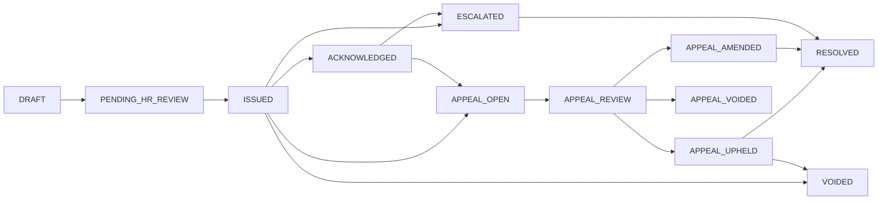

# Employee Warnings — UI Implementation Guide

This document guides building the **Datafin HRMS** frontend for **employee warnings**, aligned with:

- API and roles: [`employee-warning-flow.md`](./employee-warning-flow.md) (Sections 2–4, 3.6).
- Backend routes: `frontend` calls `GET/POST/PATCH` under `/api/employees/:id/warnings/...` (see below).

Use this alongside the main flow doc for lifecycle context; this file focuses on **screens, states, and integration**.

---

## 1) Where it lives in the product

- **Dedicated area (recommended):** [**`/dashboard/discipline`**](../../../frontend/app/dashboard/discipline/page.tsx) (**Discipline & compliance**), opened from the dashboard **More** menu. Use it for HR-wide queues, filters, and policy framing; wire to `/api/employees/:id/warnings` (no tenant-wide warnings list API yet).
- **Employee detail:** [`frontend/app/dashboard/employee/[id]/page.tsx`](../../../frontend/app/dashboard/employee/[id]/page.tsx) (`/dashboard/employee/:id`) — embed a **“Warnings”** block or tab (contextual actions while viewing one person). Keep **active / open** warnings visually above **history** (resolved, voided, ended appeals).
- Deep links from notifications should land on the **employee profile** (or discipline page with query to highlight the case, if you add that later).
- **Self-service:** Same routes work when `:id` is the **current user’s id** (and for list, backend accepts contextual patterns consistent with other employee APIs; use the same `employeeId` the app already uses for the profile).
- **Deep links:** Backend notifications use `FRONTEND_URL/dashboard/employee/:employeeId` — keep that path stable so email/in-app links land on the profile where warnings are shown.

---

## 2) API conventions (client-facing)

- **Base path:** `/api/employees/:employeeId/warnings` and nested actions (all require authenticated session; same cookie/header pattern as the rest of the dashboard).
- **Response envelope:** `success`, `message`, `data` on success; on failure `success: false`, `error`, `message` (handle `403` / `400` / `404` with clear toasts or inline errors).
- **List pagination:** `GET .../warnings?page=1&limit=50` — response includes:
  - `data`: array of warning records (full DTO shape from backend).
  - `pagination`: `page`, `limit`, `total`, `totalPages`, `hasNextPage`, `hasPreviousPage`.
  - `escalationSummary` (when returned): `activeWarningsLast12Months`, `suggestEscalationReview` (≥3 in 12 months), `hasActiveFinalWarning`. Use this for an **HR-only** compact banner or badge on the employee profile (not for `STAFF` viewing others).

**Important route ordering for appeal:** The backend registers **`.../appeal/review`** and **`.../appeal/decision`** before **`.../appeal`**. Your client only needs correct URLs; no special ordering in the UI.

---

## 3) Endpoint cheat sheet

| Action | Method | Path | Body (JSON) | Who (route guard) |
|--------|--------|------|-------------|-------------------|
| Discipline / tenant list | GET | `/api/employees/warnings/dashboard` | Query: `page`, `limit`, optional `status` (comma-separated statuses) | HR_ADMIN, HR_STAFF (full tenant); DEPARTMENT_ADMIN (managed departments only) |
| List | GET | `/api/employees/:id/warnings` | Query: `page`, `limit` | HR_ADMIN, HR_STAFF, DEPARTMENT_ADMIN, STAFF |
| Create draft | POST | `/api/employees/:id/warnings` | `title`, `category`, `severity`, `incidentDate`, `reason`, optional `policyReference`, `attachments` | HR + dept admin (scoped) |
| Edit draft | PATCH | `/api/employees/:id/warnings/:warningId` | Partial core fields (draft only) | HR + dept admin |
| Delete draft | DELETE | `/api/employees/:id/warnings/:warningId` | — | HR + dept admin (same rules as edit draft; **DRAFT** only) |
| Submit | POST | `/api/employees/:id/warnings/:warningId/submit` | Optional `reviewNote` | HR + dept admin |
| Return to draft | POST | `/api/employees/:id/warnings/:warningId/return-to-draft` | Optional `changesRequestedNote` (stored as `reviewNote`) | HR only; **`PENDING_HR_REVIEW` → `DRAFT`** |
| Issue | POST | `/api/employees/:id/warnings/:warningId/issue` | `issueNote`, `reviewDueDate` | HR only |
| Resend issued notification | POST | `/api/employees/:id/warnings/:warningId/resend-issued-notification` | — | HR only; **`ISSUED` only** — repeats in-app + email issuance notify |
| Acknowledge | POST | `/api/employees/:id/warnings/:warningId/acknowledge` | Optional `acknowledgementNote` | Subject employee or HR |
| Refuse ack | POST | `/api/employees/:id/warnings/:warningId/refuse-acknowledgement` | Optional `refuseNote` | Subject or HR |
| Open appeal | POST | `/api/employees/:id/warnings/:warningId/appeal` | `appealReason`, `employeeStatement`, optional `attachments` | Subject or HR |
| Appeal review | POST | `/api/employees/:id/warnings/:warningId/appeal/review` | (none required) | HR only |
| Appeal decision | POST | `/api/employees/:id/warnings/:warningId/appeal/decision` | `decision`: `UPHOLD` \| `AMEND` \| `VOID`; `decisionNote`; if `AMEND`, `updatedSeverity` | HR only |
| Resolve | POST | `/api/employees/:id/warnings/:warningId/resolve` | `resolutionNote` | HR only |
| Void | POST | `/api/employees/:id/warnings/:warningId/void` | `voidNote` | HR only |
| Escalate | POST | `/api/employees/:id/warnings/:warningId/escalate` | `escalationNote` | HR only |

`SUPER_ADMIN` users with tenant context behave like allowed roles for these routes (same as elsewhere in the app).

---

## 4) Enums (display + forms)

Mirror backend labels in filters and selects (use sentence case in UI if desired).

**`category`:** `ATTENDANCE`, `CONDUCT`, `PERFORMANCE`, `COMPLIANCE`, `SAFETY`

**`severity`:** `LOW`, `MEDIUM`, `HIGH`, `FINAL`

**`status` (non-exhaustive grouping for UX):**

- **Pipeline / internal:** `DRAFT`, `PENDING_HR_REVIEW`
- **Employee-visible (typical):** `ISSUED`, `ACKNOWLEDGED`, `ESCALATED`, appeal states, `RESOLVED`, `VOIDED`, `APPEAL_VOIDED`, etc.

Backend **hides** `DRAFT` and `PENDING_HR_REVIEW` from **`STAFF`** list responses; HR and dept admin see full list. Still, the UI should handle any status returned from the API defensively.

---

## 5) Immutability (what the UI should allow)

Per **§3.6** of [`employee-warning-flow.md`](./employee-warning-flow.md):

- **Edit core fields** only when `status === "DRAFT"` (enable “Edit” form + `PATCH`). After submit or issue, **disable** inline editing of title, category, severity, incident date, reason, policy ref, attachments — show read-only with optional “void / appeal” explanations in copy.
- **Do not** expose a generic “save” that maps to `PATCH` for non-drafts.
- **Severity after issue** changes only via HR **appeal decision** `AMEND` (show severity editor inside that flow only).

This avoids confusing users with 400 errors from the API.

---

## 6) Action matrix (recommended UI buttons)

For **how to lay out** those actions (primary / secondary / “More” menu, placement in the detail dialog), see [**employee-warning-action-buttons.md**](./employee-warning-action-buttons.md).

Derive visible actions from **`user.role`** (from session/store) + **`warning.status`** + **target employee id vs current user**.

### HR_ADMIN / HR_STAFF (viewing an employee they can access)

| Status | Suggested primary actions |
|--------|---------------------------|
| `DRAFT` | Edit draft, Submit, Delete draft (`DELETE .../warnings/:warningId`) |
| `PENDING_HR_REVIEW` | Issue (opens issue modal); **More:** Return to draft (`POST .../return-to-draft`) |
| `ISSUED` | Acknowledge on behalf, Refuse ack on behalf, Open appeal on behalf, Resolve, Void, Escalate; **More:** resend issued notification (`POST .../resend-issued-notification`) |
| `ACKNOWLEDGED` | Open appeal on behalf, Resolve, Void, Escalate |
| `APPEAL_OPEN` | Move to review, Void |
| `APPEAL_REVIEW` | Decision modal: Uphold / Amend / Void |
| `APPEAL_UPHELD` | Resolve, Void, Escalate |
| `APPEAL_AMENDED` | Resolve, Void, Escalate |
| `APPEAL_VOIDED` | Read-only or Void if policy treats as inactive (backend may already be terminal) |
| `ESCALATED` | Resolve, Void |
| `RESOLVED` / `VOIDED` | Read-only; optional link to audit/history |

Always use **confirm dialogs** for **Void** (destructive tone).

### DEPARTMENT_ADMIN (scoped to departments they manage)

| Capability | UI |
|------------|-----|
| List / create / edit / submit | Only if employee is in scope (backend returns 403 otherwise — surface friendly message). |
| Issue, resolve, void, escalate, appeal review/decision | **Hide** — backend denies. |

### STAFF (own record only — `employeeId === currentUserId`)

| Status | Suggested actions |
|--------|-------------------|
| `ISSUED` | Acknowledge, Refuse acknowledgement, Open appeal |
| `ACKNOWLEDGED` | Open appeal (and Escalated path if applicable) |
| Other visible statuses | Read-only unless backend allows (match matrix above for employee-facing appeal) |

Do **not** show draft/pending rows to employees if the API omits them; if ever shown, read-only.

---

## 7) Combined employee feed (`feedVariant`)

If the profile includes **`GET /api/employees/:userId/combined-feed`**, warning-related rows may appear as:

| `kind` | `feedVariant` | Suggested UI |
|--------|---------------|--------------|
| `WARNING` | `warning_issued` | Distinct icon/color; link to warnings section |
| `WARNING` | `warning_acknowledged` | Same family, different label |
| `WARNING` | `warning_resolved` | Closure tone |

Reuse the same typography as other feed kinds (leave, attendance) for consistency.

---

## 8) Component and state suggestions (React/Next)

- **Data fetching:** React Query (or existing store pattern) keyed by `employeeId`, with invalidation after every successful `POST`/`PATCH` on warnings.
- **List UI:** Table or card list with chips for `status`, `severity`, `category`; sort **active first** (not `RESOLVED`/`VOIDED`), then by `createdAt` desc (aligns with API default).
- **Filters:** Client-side filter on loaded page, or pass query params only if you add server-side filter later — v1 can filter `data` in memory by `status`, `severity`, `category`.
- **Modals:** Create/edit draft, issue, acknowledge/refuse, appeal, appeal decision (`AMEND` shows severity dropdown), resolve, void, escalate.
- **Escalation banner:** If `escalationSummary?.suggestEscalationReview || escalationSummary?.hasActiveFinalWarning`, show a non-blocking alert for HR at top of warnings panel.

---

## 9) Error and edge cases

- **403:** User wrong role or dept admin outside managed departments — message: “You don’t have access to warnings for this employee.”
- **400:** Invalid transition (e.g. issue from wrong status) — show `message` from API; refresh list.
- **Optimistic UI:** Prefer **pessimistic** updates for warnings (refetch after mutation) to stay aligned with strict state machine.

---

## 10) Out of scope (backend not present)

- CAP/PIP linkage (optional future per main doc Sprint 8).
- Bulk export of warnings (policy only in §3.7).
- Appeal **deadline** enforcement — not in API; optional UI copy only.

---

## 11) Reference diagram (state machine — HR view)

Exact allowed transitions are enforced server-side — use this for labeling **“next steps”** in the UI, not as the sole validator.

---

## 12) Checklist before release

- [ ] Warnings panel on employee detail for all roles that can open the page.
- [ ] Role-based visibility of actions matches Section 6.
- [ ] Draft create/edit/submit/issue happy path tested.
- [ ] Employee acknowledge + refuse + appeal tested on `ISSUED`.
- [ ] HR appeal review + three outcomes tested (`UPHOLD` / `AMEND` / `VOID`).
- [ ] Resolve, void, escalate + confirmations.
- [ ] Pagination on list (load more or page control).
- [ ] Escalation summary visible to HR when API returns it.
- [ ] Feed renders `warning_*` variants if combined feed is shown on the same page.
