# Payroll Module - Frontend UI Diagrams

This document contains visual diagrams for the Payroll Module frontend UI plan. All diagrams are in Mermaid format and can be viewed in VS Code, GitHub, or online editors.

---

## 1. Navigation Structure

### 1.1 HR Admin Navigation

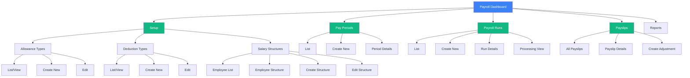

### 1.2 Employee Self-Service Navigation

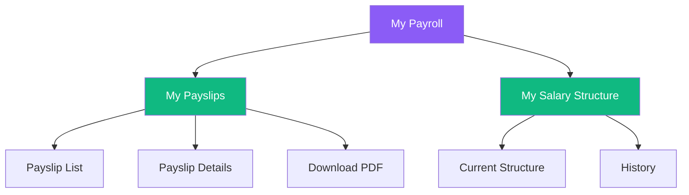

---

## 2. User Flows

### 2.1 Payroll Setup Flow (HR Admin)

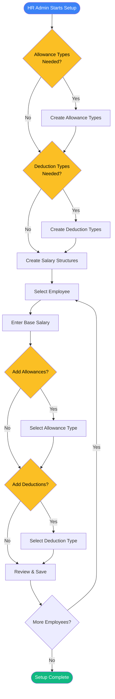

### 2.2 Payroll Processing Flow

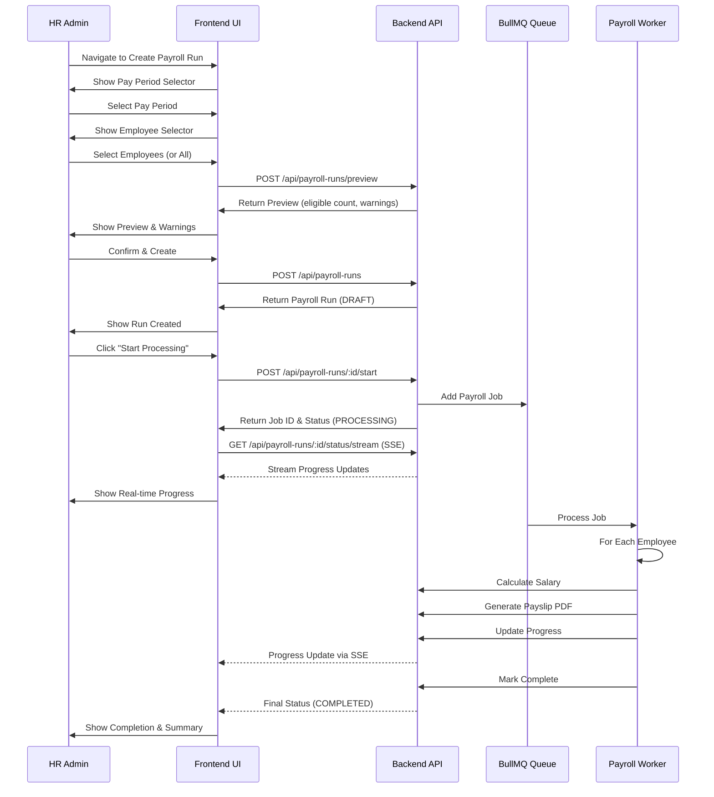

### 2.3 Payslip Distribution Flow

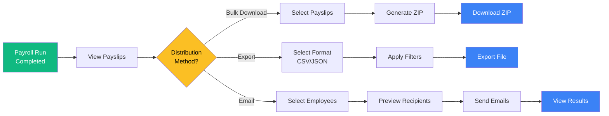

---

## 3. Page Layouts

### 3.1 Salary Structure Detail Page Layout

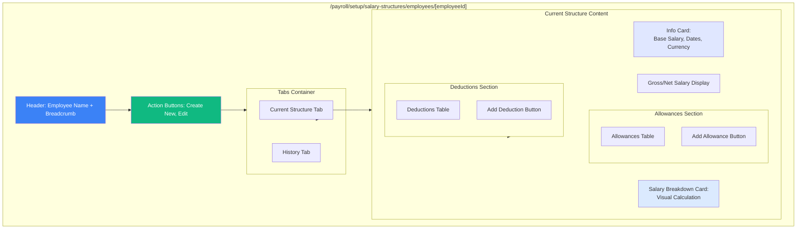

### 3.2 Payroll Run Processing View Layout

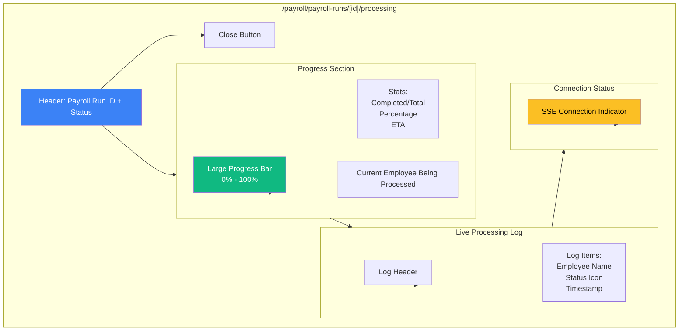

### 3.3 Payslip Details Page Layout

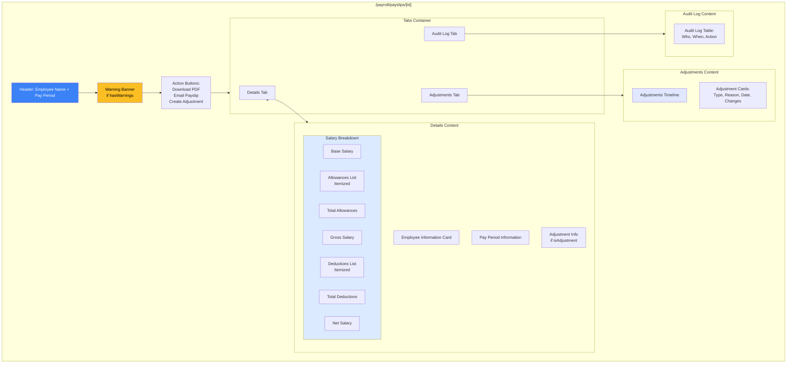

---

## 4. Component Hierarchy

### 4.1 Salary Structure Component Tree

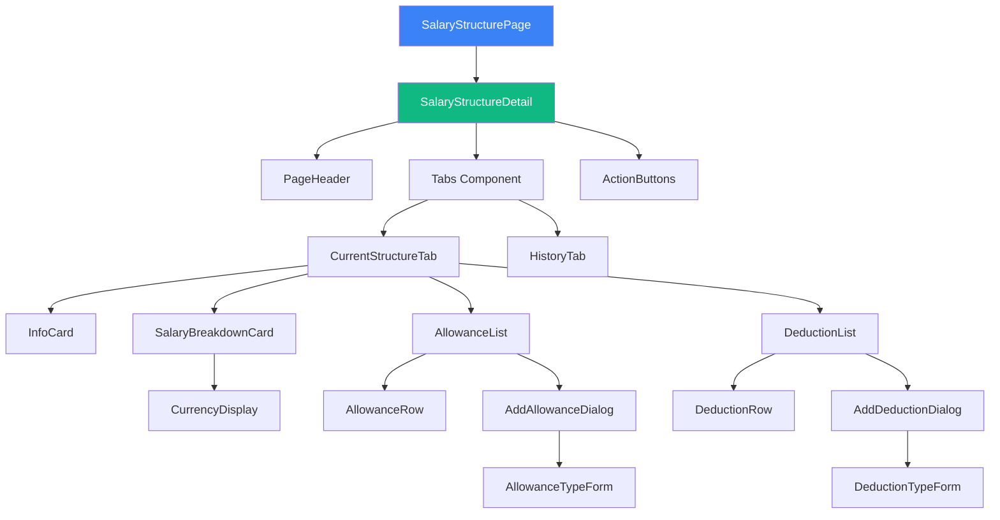

### 4.2 Payroll Run Component Tree

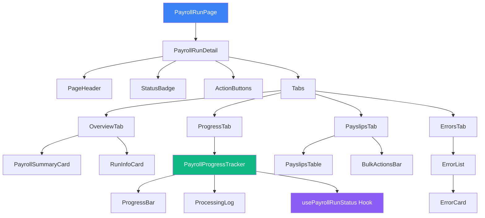

---

## 5. Multi-Step Wizard Flow

### 5.1 Create Payroll Run Wizard

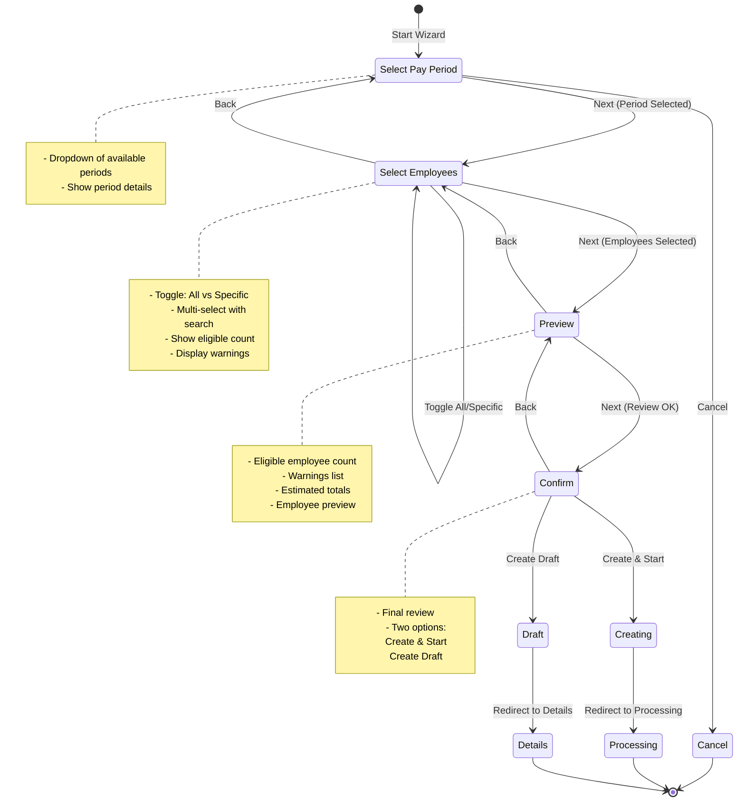

### 5.2 Create Salary Structure Wizard

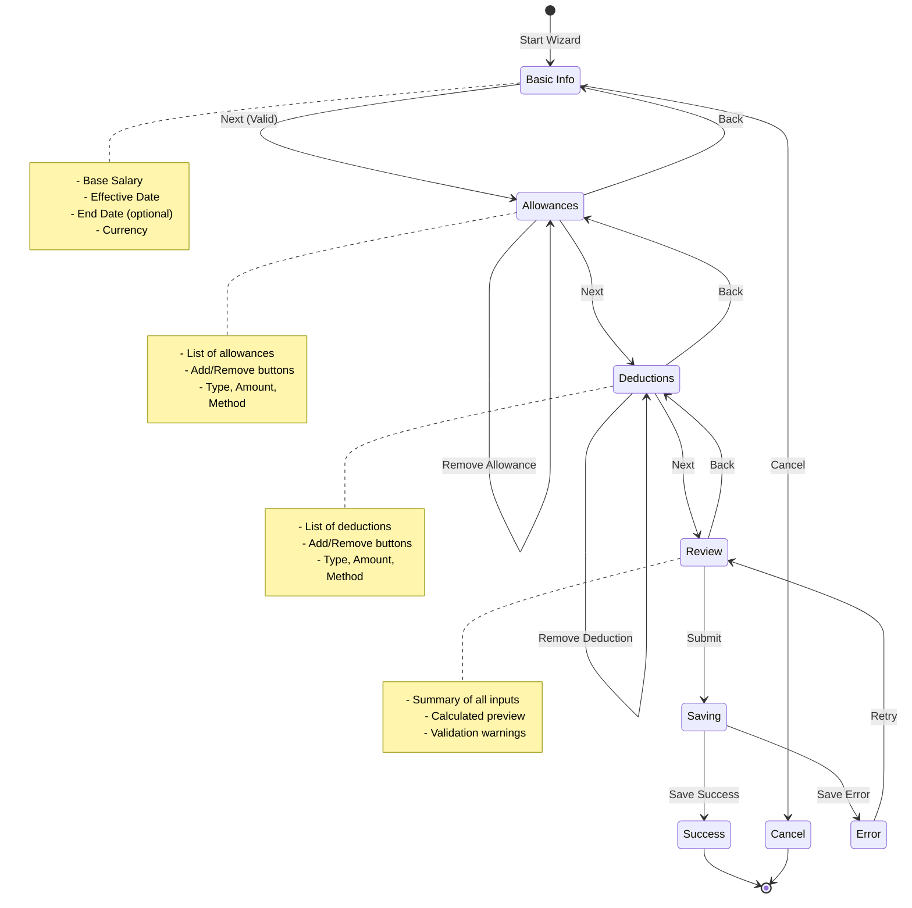

---

## 6. Permission-Based Access Flow

### 6.1 Role-Based UI Visibility

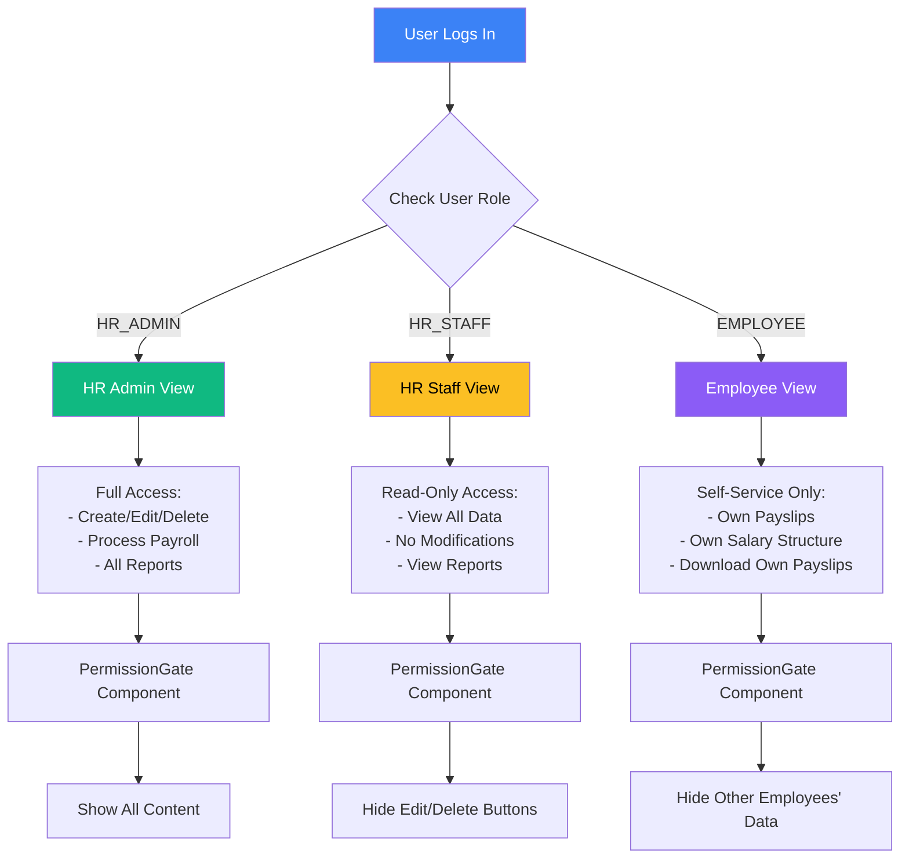

---

## 7. Real-Time Processing Flow (SSE)

### 7.1 Server-Sent Events Flow

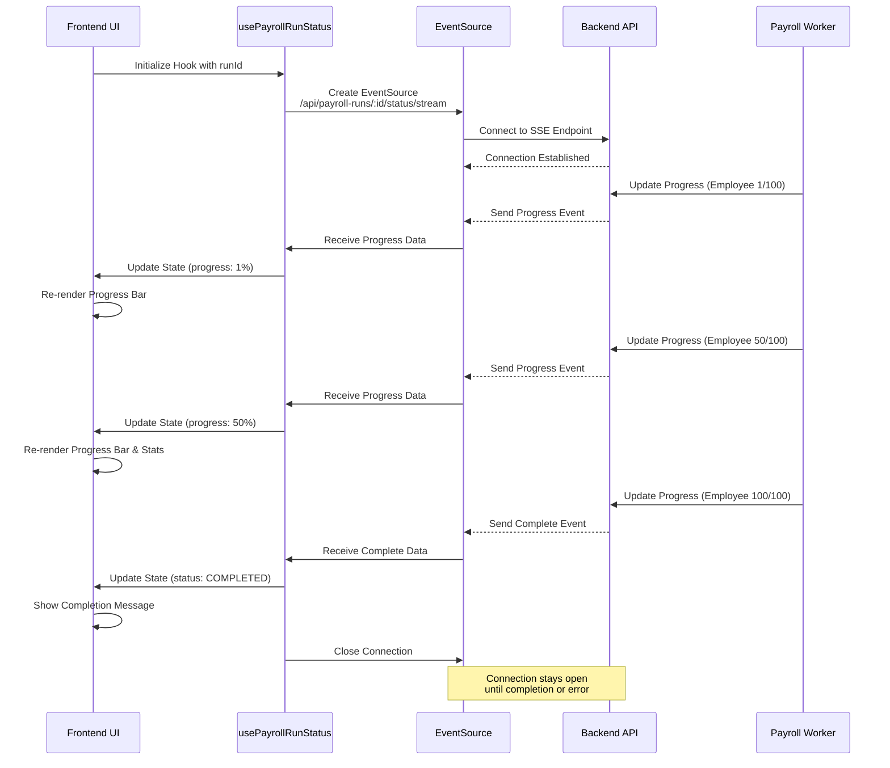

---

## 8. Data Flow: Payslip Distribution

### 8.1 Bulk Download Flow

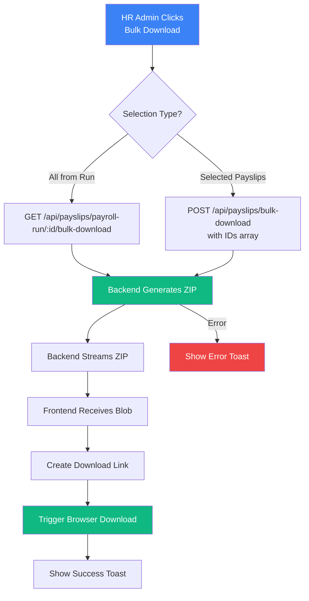

### 8.2 Email Distribution Flow

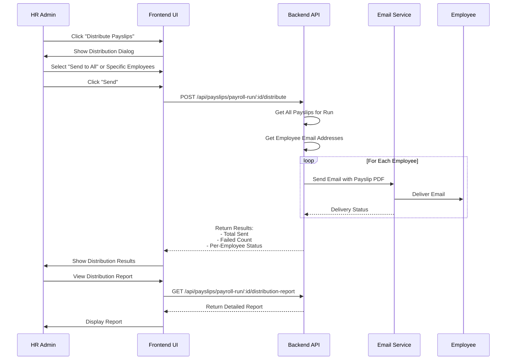

---

## 9. Component State Management

### 9.1 Zustand Store Structure

```mermaid
graph TB
    Store[usePayrollStore] --> PayPeriods[Pay Periods State]
    Store --> PayrollRuns[Payroll Runs State]
    Store --> Payslips[Payslips State]
    Store --> UIState[UI State]
    
    PayPeriods --> PP1[payPeriods: PayPeriod[]]
    PayPeriods --> PP2[selectedPayPeriod: PayPeriod | null]
    PayPeriods --> PP3[fetchPayPeriods: Function]
    
    PayrollRuns --> PR1[payrollRuns: PayrollRun[]]
    PayrollRuns --> PR2[activeRun: PayrollRun | null]
    PayrollRuns --> PR3[runProgress: RunProgress | null]
    PayrollRuns --> PR4[fetchPayrollRuns: Function]
    PayrollRuns --> PR5[subscribeToRun: Function]
    
    Payslips --> PS1[payslips: Payslip[]]
    Payslips --> PS2[selectedPayslip: Payslip | null]
    Payslips --> PS3[filters: PayslipFilters]
    Payslips --> PS4[fetchPayslips: Function]
    
    UIState --> UI1[isLoading: boolean]
    UIState --> UI2[error: string | null]
    UIState --> UI3[setError: Function]
    
    style Store fill:#8b5cf6,color:#fff
    style PayPeriods fill:#3b82f6,color:#fff
    style PayrollRuns fill:#10b981,color:#fff
    style Payslips fill:#f59e0b,color:#fff
```

---

## 10. Responsive Layout Breakpoints

### 10.1 Layout Adaptation

```mermaid
graph LR
    subgraph Desktop[Desktop > 1024px]
        D1[Multi-column Layout]
        D2[Sidebar Navigation]
        D3[Full Filter Panel]
        D4[Table View]
    end
    
    subgraph Tablet[Tablet 768px - 1024px]
        T1[2-column Layout]
        T2[Collapsible Sidebar]
        T3[Collapsible Filters]
        T4[Card/Table Toggle]
    end
    
    subgraph Mobile[Mobile < 768px]
        M1[Single Column]
        M2[Bottom Navigation]
        M3[Modal Filters]
        M4[Card View Only]
    end
    
    Desktop --> Tablet
    Tablet --> Mobile
    
    style Desktop fill:#10b981,color:#fff
    style Tablet fill:#fbbf24,color:#000
    style Mobile fill:#3b82f6,color:#fff
```

---

## Viewing These Diagrams

To view these diagrams:

1. **VS Code:** Install "Markdown Preview Enhanced" extension, then preview this file
2. **Online:** Copy any diagram code to [mermaid.live](https://mermaid.live)
3. **GitHub:** Push to repository - diagrams render automatically
4. **Obsidian:** Open this file in Obsidian - native Mermaid support

For more information, see: [Diagram Viewing Guide](../DIAGRAM_VIEWING_GUIDE.md)

---

*Last Updated: 2025-01-XX*  
*Version: 1.0*

